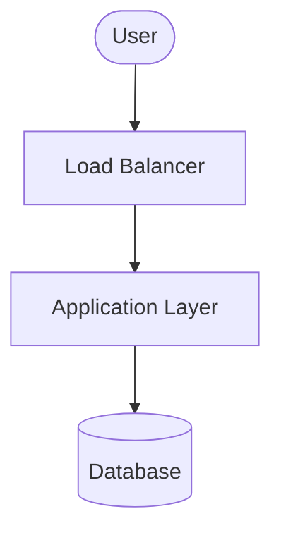

<!-- Use this template to compile the content that you generate based on the
instructions in `SKILL.md`. -->

# Google Cloud solution architecture: [Workload Name]

## 1. Executive summary and workload overview

[A brief description of the workload, its business goals, and the high-level
solution architecture proposed.]

## 2. Requirements, dependencies, and current state

### 2.1. Functional requirements

*   **Business processes**: [Details of the business processes supported]
*   **Activities and use cases**: [Details of the key activities and use cases]

### 2.2. Non-functional requirements

*   **Security**: [Details of the security requirements including compliance,
    encryption, access control requirements]
*   **Reliability**: [Details of the reliability requirements including SLA,
    RTO/RPO, backup, redundancy requirements]
*   **Cost**: [Details of the cost constraints and pricing models]
*   **Operations**: [Details of the operational requirements including
    monitoring, logging, deployment, maintenance requirements]
*   **Performance**: [Details of the performance requirements including latency,
    throughput, scaling requirements]
*   **Sustainability**: [Details of the sustainability requirements including
    carbon footprint, resource optimization requirements]

### 2.3. Current state

[If applicable, describe the current on-premises or other-cloud architecture.]

*   **Current infrastructure**: [Details of existing setup]
*   **Pain points and drivers for migration/redesign**: [Details of the drivers
    for migration/redesign]

### 2.4. Dependencies

*   **Internal dependencies**: [Details of internal dependencies including other
    workloads and internal services]
*   **External dependencies**: [Details of external dependencies including
    third-party products and on-premises tools]

## 3. Technical decomposition of the workload

[Technical decomposition of the workload components, breaking down the
application into logical services or layers.]

## 4. Proposed solution architecture

### 4.1. Google Cloud products and features mapping

[Identify Google Cloud products and features mapped to the technical components.
For each component, justify the selection, note alternatives considered, and
describe the pros and cons of the recommended product/feature and alternatives.]

| Component | Recommended Google Cloud product/feature | Justification and citations | Alternatives considered | Pros and cons of alternatives |
| :--- | :--- | :--- | :--- | :--- |
| **[Component Name]** | **[Product Name]** | [Why this product is chosen, citing official docs] | [Alternative product] | **Pros**: ...   **Cons**: ... |

### 4.2. Architecture diagram

[Architecture diagram in Mermaid format showing the relationships and flows
between the components of the architecture.]

### 4.3. Architecture description

[Detailed description of the architecture. Describe the task flow and data flow
between the components of the architecture.]

*   **Data flow**: [Describe the flow of data.]
*   **Tasks/control flow**: [Describe the flow of tasks/control.]

## 5. Design and configuration recommendations

[Best practices and configuration recommendations for each pillar of the Google
Cloud Architecture Framework.]

### 5.1. Security, privacy, and compliance

*   **Access control**: [E.g., IAM roles, least privilege policy]
*   **Data protection**: [E.g., Encryption at rest/in transit, Cloud KMS]
*   **Network Security**: [E.g., VPC, Firewalls, Cloud Armor, Private Service
    Connect]

### 5.2. Reliability

*   **Redundant deployment**: [E.g., Multi-region/regional deployment, load
    balancing]

*   **Backup and DR**: [E.g., Backups, failover procedures, RTO/RPO strategies]

### 5.3. Operational excellence

*   **Monitoring and logging**: [E.g., Cloud Logging, Cloud Monitoring,
    Dashboards]
*   **Infrastructure as Code (IaC)**: [E.g., Terraform, Deployment Manager]

### 5.4. Cost optimization

*   **Sizing and scaling**: [E.g., Autoscaling configuration, right-sizing
    resources]
*   **Pricing models**: [E.g., Commitment discounts, Spot VMs, flat-rate
    pricing]

### 5.5. Performance efficiency

*   **Caching and CDN**: [E.g., Cloud CDN, Memorystore]
*   **Database and query optimization**: [E.g., Partitioning, indexing, caching]

### 5.6. Sustainability

*   [E.g., Serverless adoption, resource utilization, carbon footprint]

## 6. Deployment guidance

[Instructions and code for deploying the architecture.]

### 6.1. Deployment prerequisites

*   [Prerequisite 1: E.g., Enabling APIs]
*   [Prerequisite 2: E.g., Installing SDK/tools]
*   ...and so on

### 6.2. Step-by-step deployment instructions

1.  [Step 1: E.g., Authenticate with Google Cloud]
2.  [Step 2: E.g., Initialize Terraform]
3.  [Step 3: E.g., Apply Terraform configuration]

## 7. Validation plan

[Details of the steps to verify that the generated solution meets the workload's
requirements. Also include references to any validation scripts that were
generated.]

## 8. References

[Links to useful and authoritative resources, such as relevant Google Cloud
documentation pages.]
